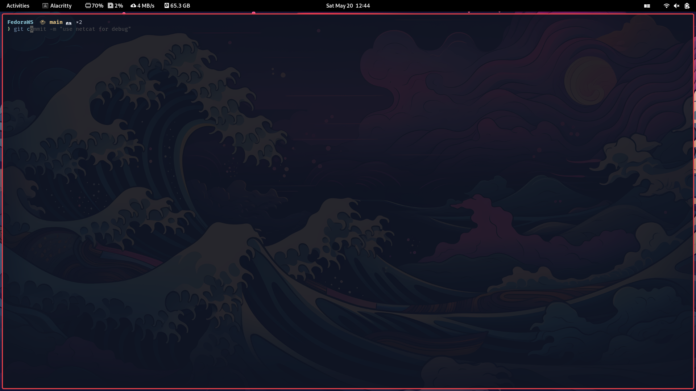

# Fedora PC Setup

This Ansible playbook automates the installation and setup of the packages and configurations I use on Fedora.

## Packages Installed

- [Brave Browser](https://brave.com/)
- [Visual Studio Code](https://code.visualstudio.com/)
- [Docker CE](https://docs.docker.com/engine/install/)
- [Alacritty](https://github.com/alacritty/alacritty)
- [Fish Shell](https://fishshell.com/)
- [Neovim](https://neovim.io/)
- [Git Delta](https://github.com/dandavison/delta)
- [Duf](https://github.com/muesli/duf)
- [Foliate](https://johnfactotum.github.io/foliate/)
- [Pop Shell](https://github.com/pop-os/shell)

## GNOME Extensions Installed

- [Vitals](https://extensions.gnome.org/extension/1460/vitals/) by CoreCoding.com
- [No Topleft Hot Corner](https://extensions.gnome.org/extension/118/no-topleft-hot-corner/) by yaya.cout
- [Sp-Tray](https://extensions.gnome.org/extension/358/sp-tray/) by sp-tray.esenliyim.github.com
- [Spotify Controller](https://extensions.gnome.org/extension/55/media-player-indicator/) by koolskateguy89
- [Custom Accent Colors](https://extensions.gnome.org/extension/1465/custom-accent-colors/) by demiskp
- [User Themes](https://extensions.gnome.org/extension/19/user-themes/) by gnome-shell-extensions.gcampax.github.com
- [Background Logo](https://extensions.gnome.org/extension/208/background-logo/) by fedorahosted.org
- [AppIndicator Support](https://extensions.gnome.org/extension/615/appindicator-support/) by rgcjonas.gmail.com
- [Pop Shell](https://extensions.gnome.org/extension/1160/pop-shell/) by system76.com

## Screenshots

Here are some screenshots of the Fedora PC setup:

## Usage

1. Clone the repository: `git clone https://github.com/yourusername/your-repo.git`
2. Install Ansible: `sudo dnf install ansible`
3. Customize the playbook file `setup.yml` with your desired configurations.
4. Run the playbook: `ansible-playbook setup.yml -K`

Feel free to customize the playbook and add your own packages or configurations as needed.
